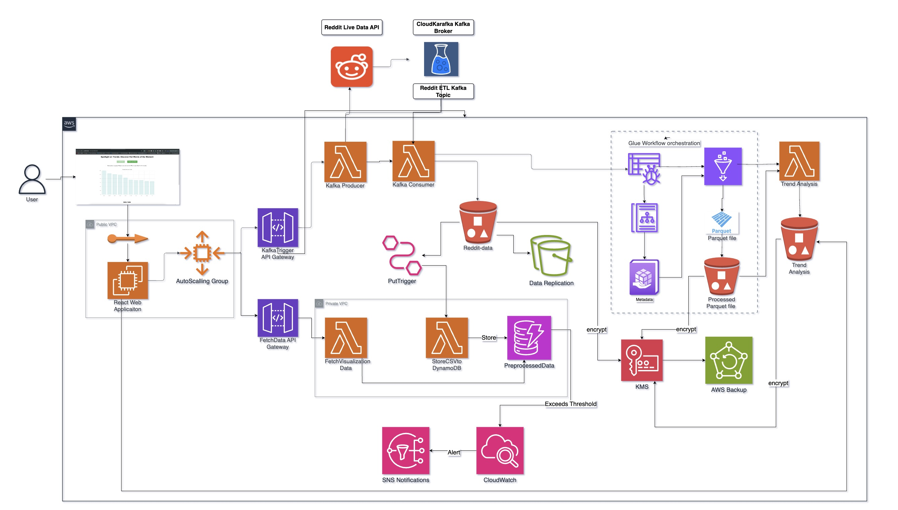

# Reddit Data Processing Application

## Overview

This application processes real-time Reddit data using AWS services to analyze trends and visualize insights. It demonstrates a scalable, secure, and efficient cloud-based architecture for handling large volumes of social media data.

## Architecture



## Delivery Model

The application is deployed on AWS, utilizing both Function-as-a-Service (FaaS) and Infrastructure-as-a-Service (IaaS) models. AWS Lambda is used for backend processing, while an EC2 instance hosts the front-end web application.

## Deployment Model

The application is deployed in a public cloud (AWS) environment, leveraging various AWS services for scalability, security, and cost optimization.

## Components

### AWS Services Used

- **Amazon EC2**: Hosts the front-end web application.
- **AWS Lambda**: Used for backend processing, including:
  - **FetchRedditData**: Fetches data from the Reddit API and sends it to Kafka.
  - **StoreCsvToDynamoDB**: Stores data from S3 to DynamoDB.
  - **FetchDataforDashboard**: Fetches preprocessed data for the web app dashboard.
- **Amazon S3**: Stores raw and processed data.
- **Amazon DynamoDB**: Stores preprocessed Reddit data for querying.
- **Amazon Kinesis**: Processes data streams.
- **Amazon Glue**: Performs ETL jobs to transform raw data into a consumable format.
- **Amazon CloudWatch**: Monitors the application.
- **Amazon SNS**: Sends alerts.
- **AWS KMS**: Encrypts data stored in S3 and DynamoDB.

## How It Works

1. **Data Collection**: The `FetchRedditData` Lambda function fetches data from the Reddit API and sends it to a Kafka topic.
2. **Data Processing**: A Kafka consumer, deployed as the `StoreCsvToDynamoDB` Lambda function, reads the data, processes it, and stores it in an S3 bucket.
3. **Data Storage**: The processed data is stored in DynamoDB for easy querying. S3 stores raw and intermediate data.
4. **ETL Pipeline**: An AWS Glue workflow is triggered to transform raw data into a parquet format.
5. **Trend Analysis**: The `FetchDataforDashboard` Lambda function performs trend analysis on the data and stores the results in S3.
6. **Visualization**: The web app, hosted on an EC2 instance, displays the top trending words and preprocessed Reddit posts. Users can click the "Update Data" button to fetch the latest data.

## Setup Instructions

1. **Clone the Repository**

   ```bash
   git clone https://github.com/Kaushikdhola/CloudArcTermFrontEnd.git
   cd reddit-data-processing-app

2. **Deploy AWS resources**
- Use the provided CloudFormation template or Terraform scripts to deploy the AWS infrastructure.
- Ensure to set up the necessary IAM roles and policies.

3. **Configure environment variables**
- Set up Reddit API credentials and other necessary configurations.

4. **Deploy Lambda functions**
- Package and deploy the Kafka Producer, Consumer, and Analysis Lambda functions.

5. **Set up Glue jobs**
- Create and configure the Glue ETL job for data transformation.

6. **Deploy frontend application**
- Navigate to the frontend directory:
  ```
  cd frontend
  npm install
  npm run build
  ```
- Deploy the built files to your EC2 instance or S3 bucket for static hosting.

7. **Configure API Gateway**
- Set up the necessary API endpoints and link them to the appropriate Lambda functions.

## Usage

1. Access the web application through the provided URL.
2. Use the dashboard to view real-time Reddit data trends and insights.
3. Click the "Update Data" button to fetch the latest data from Reddit.

## Monitoring and Maintenance

- Use CloudWatch dashboards to monitor application performance and health.
- Set up CloudWatch alarms and SNS topics for critical alerts.
- Regularly review and update AWS resources for optimal performance and cost-efficiency.

## Security

- All data is encrypted at rest using AWS KMS.
- API access is secured through API Gateway.
- Network security is enforced using VPC configurations.
- Regular security audits are recommended.

## Backup and Recovery

- AWS Backup is configured for automated, regular backups of critical data.
- Ensure to test recovery procedures periodically.